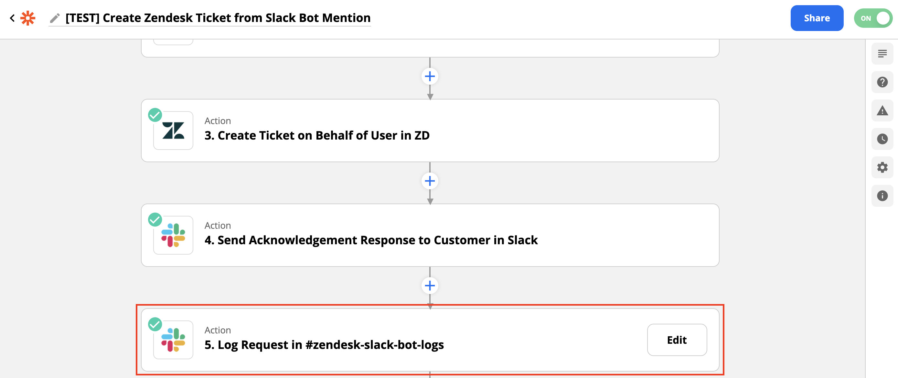

# slack-support-bot <!-- omit in toc -->
Slack Event Listener and Webhook Handler for the Deepgram Support Bot!

## Development and Contributing <!-- omit in toc -->

Interested in contributing? We ❤️ pull requests!

To make sure our community is safe for all, be sure to review and agree to our
[Code of Conduct](./CODE_OF_CONDUCT.md). Then see the
[Contribution](./CONTRIBUTING.md) guidelines for more information.

**Table of Contents:**
- [Quick Look](#quick-look)
- [Setup and Configuration](#setup-and-configuration)
- [User Manual](#user-manual)
- [Features](#features)
  - [Ticket Creation from `app_mention` Events](#ticket-creation-from-app_mention-events)
  - [Ticket Creation from :link: `reaction_added` Events](#ticket-creation-from-link-reaction_added-events)
  - [Bidirectional Reply Connection](#bidirectional-reply-connection)
  - [Channel Tracking and Delivery of Mass Updates (Megaphone)](#channel-tracking-and-delivery-of-mass-updates-megaphone)
  - [Event Logging in the `#zendesk-slack-bot-logs` Channel](#event-logging-in-the-zendesk-slack-bot-logs-channel)
- [Coming soon!](#coming-soon)

## Quick Look
- Ticket creation from bot `@mentions` and reactions
- Bidirectional reply connection (from Slack and Zendesk conversation threads)
- Customer Support Channel tracking and mass updates
- Event logging in `#zendesk-slack-bot-logs` channel
<br> </br>

## Features
### Ticket Creation from `app_mention` Events
#### Data Shape (list) <!-- omit in toc -->
```
client_msg_id:     # Root element in the message event data
type: app_mention  # The type of event that was triggered
text:              # The text of the message the bot was mentioned in
user:              # User Mentioned (should be the bot user)
ts:                # Epoch timestamp for the message event (high-precision)
team:              # Team associated with the mentioned user
blocks:            # Block (message sub-object) keys
1: type
2: block_id
3: elements
channel:           # ID of the channel that the mention was invoked in
event_ts:          # Epoch timestamp for the mention event (high-precision)
querystring:       # Request query string, if applicable
```
#### Associated Zap <!-- omit in toc -->
**Zapier Link:** [Create Zendesk Ticket from Slack Bot Mention](https://zapier.com/shared/stage-create-ticket-from-slack-bot-mention/69abe05e976aaa84cdda009a34483eb8e3a4b139)
<br> </br>

### Ticket Creation from :link: `reaction_added` Events
#### Data Shape (list) <!-- omit in toc -->
```
type:	message   # The type of event that was triggered
channel:	      # ID for the channel the reaction was invoked in
ts:	              # Epoch timestamp (high-precision)
reaction:	link  # The emoji reaction that was added to the message
item_user:	      # ID for the user that initially submitted the message
user:	          # ID for the user that applied the reaction to the message
```
#### Associated Zap <!-- omit in toc -->
**Zapier Link:** [Create Tickets from Support Team Reactions](https://zapier.com/shared/stage-create-tickets-from-support-reactions/abb607e302475fa6f9264cabf7448641c1fb7cc1)
<br> </br>

### Bidirectional Reply Connection 
#### Data Shape (From ZD > Slack) <!-- omit in toc -->
```
slack_message_id:   # Epoch timestamp of the threaded Zendesk reply in Slack (high-precision)
slack_channel_id:   # ID of the Slack channel that the Zendesk update was posted in
ticket_text:        # Text of the Zendesk update, posted in the Slack thread 
querystring:        # Request query string, if applicable
```
#### Associated Zap <!-- omit in toc -->
**Zapier Links:**
- [Zendesk Ticket Update Connector](https://zapier.com/shared/stage-zendesk-support-slack-reply-connector/a59a855a197ae31f06d89d9d1ecf58b1a0aceeca)
- [Connect Slack Replies to Zendesk](https://zapier.com/shared/stage-connect-slack-replies-to-zendesk/ed92590ed605f5931fa651b621291c00fde149ff)
<br> </br>

### Channel Tracking and Delivery of Mass Updates (Megaphone)
#### Data Shape <!-- omit in toc -->
```
type:	message   # The type of event that was triggered
channel:	      # ID for the channel the reaction was invoked in
ts:	              # Epoch timestamp (high-precision)
reaction:	mega  # The emoji reaction that was added to the message
item_user:	      # ID for the user that initially submitted the message
user:	          # ID for the user that applied the reaction to the message
```
### Associated Zap <!-- omit in toc -->
**Zapier Links:**
- [Log Support Slack Channel Names and IDs](https://zapier.com/shared/stage-log-support-slack-channels-and-ids/56b537b6003d1760c55ec4ca508dc2cfc874d761)
- [Deepgram Megaphone (Mass Announcements)](https://zapier.com/shared/cce919d095e6093438ec8cd3fe8876f9a39f572b)
<br> </br>

### Event Logging in the `#zendesk-slack-bot-logs` Channel
#### Data Shape <!-- omit in toc -->
```
channel: C035B4153N0     # ID of the logging channel in Slack
ts:                      # Epoch timestamp of the message posted in the logging channel (high-precision)
message:                 # Message details
    type: message      
    subtype: bot_message 
    text:               # Text of the message posted in the logging channel  
ts:                     # Timestamp of the message posted in the logging channel
username: DG Support    # Username of the bot posting the message
bot_id: B035B17QWUU     # ID of the bot posting the message
permalink:              # Permalink of the Zap run
ts_time:            # UTC Timestamp of the message posted in the logging channel
```
#### Associated Zap <!-- omit in toc -->
Logging events are included as the final step executed for the zap associated with the feature being logged -- for example:

<br> </br>


## Coming soon!
- Configuration Steps for the app in Slack workspaces
- Upgrade to the new Bolt Slack SDK for Python
- Zapier Automation Review
- Feature Request Process


## Getting Help

We love to hear from you so if you have questions, comments or find a bug in the
project, let us know! You can either:

- [Open an issue](https://github.com/deepgram/[reponame]/issues/new) on this repository
- Tweet at us! We're [@DeepgramDevs on Twitter](https://twitter.com/DeepgramDevs)

## Further Reading

Check out the Developer Documentation at [https://developers.deepgram.com/](https://developers.deepgram.com/)
